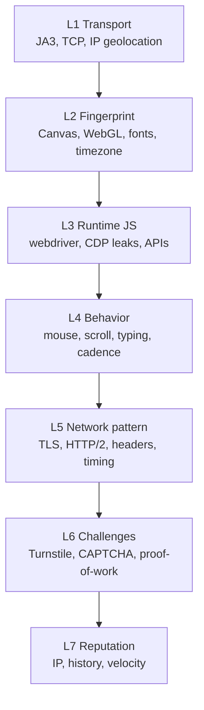

# Foxcape — Stealth Roadmap

**Version:** 1.0
**Status:** Active
**PyPI:** `foxcape`
**Baseline release:** v0.1.0 (initial PyPI publish)
**License:** MIT | **Python:** `>=3.10,<4.0`

---

## Purpose

This document defines the phased stealth roadmap for Foxcape. It is the **strategic input** for SpecKit SDD cycles — one spec folder per phase under `specs/`.

| Phase | Target version | SpecKit folder (planned) |
|-------|----------------|--------------------------|
| Phase 0 | v0.1.x | `specs/001-initial-release/` *(done)* |
| Phase 1 | v0.2 | `specs/002-identity-coherence/` |
| Phase 2 | v0.3 | `specs/003-production-biometrics/` |
| Phase 3 | v0.4 | `specs/004-profile-reputation/` |
| Phase 4 | v0.5 | `specs/005-challenges-resilience/` |
| Phase 5 | v0.6+ | `specs/006-stealth-observability/` |

**How to use with SpecKit:**

```
1. /speckit-specify   → derive spec.md from the phase section below
2. /speckit-clarify   → resolve open questions before planning
3. /speckit-plan      → plan.md, research.md, contracts/, quickstart.md
4. /speckit-tasks     → tasks.md
5. /speckit-analyze   → GATE — do not code before approval
6. /speckit-implement → execute tasks.md
7. /speckit-converge  → test-evidence.json + release tag
```

Each phase MUST respect the [constitution](../.specify/memory/constitution.md): Camoufox-only engine, offline CI, stable `__all__`, optional extras for heavy deps.

---

## Positioning

Foxcape will not promise "100% undetectable." Modern anti-bot systems cross-reference dozens of signals across multiple layers. The goal is **maximum mitigation through defense in depth** — consistent identity, credible behavior, and session reputation.

**Target niche:**

> **Camoufox-first, identity-coherent, hybrid-capable, behaviorally realistic**

Do not compete head-to-head with raw HTTP clients (curl_cffi) or unmodified Playwright. Win by being the only Python library that binds **browser stealth + HTTP session export + biometrics + aged profiles** behind a simple API (`Foxcape`, `AsyncFoxcape`, `FoxcapeResult`).

---

## Mental Model: 7 Detection Layers



**Golden rule:** if L2 says "Windows + Firefox" but L5 sends a Python `requests` JA3 fingerprint, or L1 uses a datacenter IP while L2 claims São Paulo — detection happens **before any JavaScript runs**.

Layers must be **internally consistent** within a single session. Inconsistency is the #1 avoidable cause of blocks in production.

---

## Current State (v0.1.0)

| Layer | Status | Primary gap |
|-------|--------|-------------|
| **L1 Transport** | Partial (via Camoufox in browser) | No HTTP client with mirrored TLS fingerprint |
| **L2 Fingerprint** | Strong (Camoufox + noise + hardware spoof) | No validation of profile/proxy/geo coherence |
| **L3 Runtime JS** | Strong (Camoufox C++ patches) | Depends on upstream Camoufox releases |
| **L4 Behavior** | Good (WindMouse, Markov cadence, biometric typing) | Generic scroll/click; no real-telemetry calibration |
| **L5 Network pattern** | Weak outside browser | No session export; no header ordering on HTTP leg |
| **L6 Challenges** | Turnstile only | hCaptcha, reCAPTCHA, proof-of-work |
| **L7 Reputation** | Basic warmup | No IP scoring; no profile aging model |

**Existing modules (baseline):**

| Module | Layer coverage |
|--------|----------------|
| `camoufox_launch.py` | L1–L3 (launch + evasion injection) |
| `noise_injector.py` | L2 |
| `hardware_spoofing.py` | L2, L3 |
| `humanizer.py` | L4 |
| `cadence.py`, `scrape_cadence.py` | L4 |
| `turnstile_and_typing.py` | L4, L6 |
| `profiles.py` | L7 |
| `proxy_pool.py` | L1, L7 |

---

## Out of Scope (Anti-Patterns)

These ideas were evaluated and **rejected** for Foxcape's roadmap:

| Idea | Reason |
|------|--------|
| Migrate to Nodriver / Chrome CDP | Abandons Camoufox C++ patches; violates constitution |
| Absorb DrissionPage wholesale | Massive complexity; unfocused scope |
| Multi-engine (Firefox + Chrome) | Doubles maintenance surface |
| Aggressive JS `toString` spoofing beyond current scripts | Detected by modern fingerprint scanners |
| Promise "zero detection" in marketing | False claim; destroys trust |

---

## Phased Roadmap

### Phase 0 — v0.1.x (current): Consolidate & Measure

**Objective:** Do not regress; establish a measurement baseline.

**SpecKit:** `specs/001-initial-release/` *(complete)*

| Deliverable | Mitigates | Status |
|-------------|-----------|--------|
| PyPI publish v0.1.0 | Adoption, feedback loop | Done |
| Offline test suite (181+ tests, ~99% coverage) | Regressions | Done |
| Live integration tests (`@pytest.mark.live`) | Real-world validation | Done (2 tests) |
| Live test suite against known targets (Cloudflare, DataDome demos, BrowserLeaks, CreepJS) | Blind optimization | **TODO** |
| Compatibility matrix doc ("works on X, fails on Y") | User expectations | **TODO** |
| `StealthScore` — post-launch consistency checks with warnings | Silent config mismatches | **TODO** |

> Without measurement, stealth work is guesswork.

**Exit criteria for Phase 0:**

- [ ] v0.1.0 tagged and published on PyPI
- [ ] At least 5 live-target tests (opt-in marker) documented in README
- [ ] Compatibility matrix published under `docs/`
- [ ] `StealthScore` prototype runs on browser start (warn-only, no hard fail)

---

### Phase 1 — v0.2: Identity Coherence *(highest ROI)*

**Objective:** One session = one consistent digital identity.

**SpecKit:** `specs/002-identity-coherence/`

| Deliverable | Mitigates |
|-------------|-----------|
| `IdentityBundle` — binds OS + locale + timezone + viewport + UA + proxy GeoIP | Geo/timezone/locale mismatch |
| `validate_identity()` — called before first navigation | Silent misconfiguration |
| `export_session()` — cookies + headers + proxy + fingerprint metadata | Identity break when leaving browser |
| `HttpSession` optional extra (`foxcape[http]` + curl_cffi) with OS-aligned impersonate | Python JA3 vs browser JA3 |
| Consistent header ordering and `Sec-CH-UA` on HTTP leg | HTTP/2 fingerprint mismatch |

**Why first:** most production blocks come from **inconsistency**, not from missing WindMouse curves.

**Planned API (v0.2 preview):**

```python
from foxcape import Foxcape, FoxcapeConfig

with Foxcape(FoxcapeConfig()) as fox:
    fox.validate_identity()          # proxy SP + locale pt-BR + tz America/Sao_Paulo ✓
    fox.get("https://site.com/login")
    session = fox.export_session()     # cookies + UA + proxy + OS fingerprint
    session.get("https://site.com/api/data")  # mirrored TLS, no browser restart
```

**New modules (planned):**

| Module | Responsibility |
|--------|----------------|
| `identity.py` | `IdentityBundle`, validation rules, GeoIP/locale/timezone coherence |
| `http_session.py` | `HttpSession`, curl_cffi backend, cookie/header transfer |
| `stealth_score.py` | Post-launch checks (extends Phase 0 prototype) |

**Optional dependency group:**

```toml
[project.optional-dependencies]
http = ["curl_cffi>=0.7,<1.0"]
```

**Exit criteria:**

- [ ] `validate_identity()` catches at least 3 known mismatch patterns (geo, locale, timezone)
- [ ] `export_session()` round-trips cookies from browser to HTTP leg
- [ ] HTTP leg JA3 impersonate matches `FoxcapeConfig.os`
- [ ] All new code covered by offline mocks; live test for one hybrid flow
- [ ] Public API additions documented in `contracts/public-api.md`

---

### Phase 2 — v0.3: Production Biometrics

**Objective:** Pass behavioral analytics (DataDome, PerimeterX, Akamai Bot Manager).

**SpecKit:** `specs/003-production-biometrics/`

| Deliverable | Mitigates |
|-------------|-----------|
| Bézier trajectories + overshoot + micro-corrections (complement WindMouse) | Dead-center click heatmaps |
| Inertial scroll (acceleration/deceleration, mid-scroll pauses) | Linear robotic scrolling |
| Calibrated distributions (log-normal dwell, not uniform) | Statistically impossible timing |
| Click offset within target element (not dead-center) | Pointer heatmap analysis |
| Occasional `focus()` / `blur()` / tab navigation | Sessions with zero keyboard interaction |
| Pointer events with `pressure` / `tilt` where supported | Touch/stylus heuristics |

**Principle:** evolve WindMouse — do not replace it. Extend existing Hypothesis property tests (`test_humanizer_properties.py`) for new distributions.

**Modules touched:**

| Module | Change |
|--------|--------|
| `humanizer.py` | Bézier paths, inertial scroll, click offset |
| `rng.py` | Log-normal and calibrated sampling helpers |
| `scrape_cadence.py` | Wire new behavior into post-navigation cadence |
| `turnstile_and_typing.py` | Tab/focus integration during challenges |

**Exit criteria:**

- [ ] Hypothesis tests cover monotonicity and distance invariants for new path generators
- [ ] Scroll simulation uses non-linear delta sequences
- [ ] Dwell times sampled from log-normal, not uniform
- [ ] No regression in offline test count or coverage floor (≥95% on touched modules)

---

### Phase 3 — v0.4: Reputation & Profile Aging

**Objective:** Look like a returning user, not a freshly spawned bot.

**SpecKit:** `specs/004-profile-reputation/`

| Deliverable | Mitigates |
|-------------|-----------|
| Expanded warmup (categories + configurable depth) | Empty cookie jar |
| `ProfileAge` — domain visit history, inter-visit timing | "Too new" session signal |
| Sticky proxy per profile (extend `proxy_pool.py`) | Suspicious IP rotation |
| Intelligent velocity limits (requests/min per domain) | Detectable bulk scraping |
| Storage persistence (localStorage, IndexedDB) across runs | Amnesic profile |
| Simulated return visits (revisit URLs from history) | Linear navigation patterns |

**Modules touched:**

| Module | Change |
|--------|--------|
| `profiles.py` | `ProfileAge`, storage persistence, return-visit simulation |
| `proxy_pool.py` | Profile-bound sticky sessions |
| `config.py` | Velocity limit settings |

**Exit criteria:**

- [ ] Profile metadata tracks domain history and visit intervals
- [ ] Warmup depth configurable; partial warmup remains tolerant (existing behavior)
- [ ] Velocity limiter integrated into `get()` / `afetch()` with jitter
- [ ] Live test: aged profile passes a target that rejects fresh sessions

---

### Phase 4 — v0.5: Challenges & Resilience

**Objective:** Survive when the first line of defense triggers.

**SpecKit:** `specs/005-challenges-resilience/`

| Deliverable | Mitigates |
|-------------|-----------|
| hCaptcha / reCAPTCHA v2/v3 (optional plugin) | CAPTCHAs beyond Turnstile |
| Automatic challenge-page detection + retry strategy | Silent blocks |
| Proof-of-work / JS challenge intelligent wait | Cloudflare interstitials |
| `foxcape[captcha]` extra with provider adapters (2captcha, etc.) | Unsolvable local challenges |
| Per-domain circuit breaker (exponential backoff + jitter) | Aggression bans |

**Optional dependency group:**

```toml
[project.optional-dependencies]
captcha = ["httpx>=0.27,<1.0"]  # provider API calls; exact deps TBD in spec
```

**Modules touched:**

| Module | Change |
|--------|--------|
| `turnstile_and_typing.py` | Refactor into challenge framework |
| `challenges/` *(new package)* | Pluggable solvers: Turnstile, hCaptcha, reCAPTCHA |
| `scraper.py`, `async_scraper.py` | Challenge detection hook, circuit breaker |

**Exit criteria:**

- [ ] Turnstile solver unchanged (no regression)
- [ ] At least one additional CAPTCHA type behind optional extra
- [ ] Circuit breaker configurable per `FoxcapeConfig`
- [ ] Challenge detection covered by offline mocks

---

### Phase 5 — v0.6+: Stealth Observability

**Objective:** Know *why* a session failed and iterate fast.

**SpecKit:** `specs/006-stealth-observability/`

| Deliverable | Mitigates |
|-------------|-----------|
| `foxcape diagnose` CLI — runs CreepJS/BrowserLeaks/internal checks, outputs report | Blind debugging |
| HAR export + diff of blocked vs allowed requests | WAF analysis |
| Stealth regression suite in CI (live, opt-in) | Version-to-version regressions |
| Opt-in anonymous success-rate telemetry by domain | Feature prioritization from real data |

**Modules touched:**

| Module | Change |
|--------|--------|
| `diagnostics/` *(new package)* | CLI, report generation, target runners |
| `stealth_score.py` | Full scoring (extends Phase 0/1 prototype) |

**Exit criteria:**

- [ ] CLI runs offline self-checks without network
- [ ] Live diagnose mode documented and opt-in
- [ ] HAR export available from `Foxcape` / `AsyncFoxcape`
- [ ] Regression suite documented in CI workflow comments

---

## Priority Order (Maximum Mitigation, Minimum Effort)

When resources are constrained, implement in this order:

```
1. Identity coherence (Phase 1)      ← ~70% of avoidable blocks
2. Hybrid browser→HTTP session (Phase 1) ← scale without reopening browser
3. Calibrated biometrics (Phase 2)   ← behavioral analytics sites
4. Profile reputation (Phase 3)      ← sites requiring session history
5. Extra CAPTCHAs (Phase 4)          ← when 1–4 are insufficient
6. Observability (Phase 5)           ← accelerates everything above
```

---

## Outside the Library (Critical but Not Foxcape Code)

These factors determine stealth as much as library features. Document in README; do not scope into Foxcape modules:

| Factor | Impact |
|--------|--------|
| Residential/mobile proxy quality | L1, L7 — datacenter IPs with dirty history fail regardless of JS spoofing |
| Pipeline rate limiting | L7 — library velocity limits help, but orchestration matters |
| Legal / ToS compliance | User responsibility; Foxcape ships a disclaimer |
| Target site changes | Anti-bot vendors update continuously; compatibility matrix must be maintained |

---

## Version & Release Mapping

| Version | Phase | Theme | Breaking changes expected |
|---------|-------|-------|-------------------------|
| v0.1.x | 0 | Initial release, measurement | None (baseline) |
| v0.2 | 1 | Identity coherence + hybrid HTTP | New public API additions only |
| v0.3 | 2 | Production biometrics | Behavior timing may shift slightly |
| v0.4 | 3 | Profile reputation | New config fields (defaults preserve v0.3 behavior) |
| v0.5 | 4 | Challenges & resilience | Optional extras only |
| v0.6+ | 5 | Observability | CLI added; no breaking API changes |

Follow [GitFlow](GITFLOW.md): features on `develop`, releases via `release/vX.Y.Z` → `main` + tag.

---

## Related Documents

| Document | Purpose |
|----------|---------|
| [PLAN.md](PLAN.md) | Master plan for v0.1.0 (initial release) |
| [ARCHITECTURE.md](ARCHITECTURE.md) | Module layout and quality gates |
| [GITFLOW.md](GITFLOW.md) | Branching and release process |
| [constitution](../.specify/memory/constitution.md) | Non-negotiable project principles |
| `specs/00N-*/spec.md` | Per-phase SpecKit specifications (generated from this roadmap) |

---

## Changelog

| Date | Version | Change |
|------|---------|--------|
| 2026-08-19 | 1.0 | Initial stealth roadmap — Phases 0–5 |
